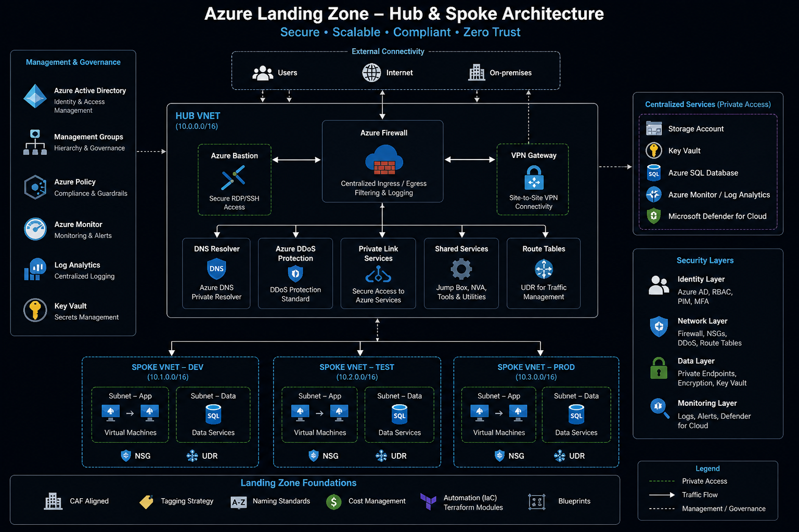

Development & Testing Enviroment
# Azure Enterprise Landing Zone with Terraform

Enterprise-grade Azure landing zone architecture designed using Terraform and Zero Trust principles to provide secure, scalable, and governance-driven cloud foundations for modern workloads.

---

# Overview

This project demonstrates the design and implementation of a production-oriented Azure landing zone architecture using Infrastructure as Code (IaC) and modular Terraform design patterns.

The architecture focuses on:

- Security-first cloud foundations
- Hub-and-spoke networking
- Zero Trust architecture principles
- Infrastructure standardization
- Governance and policy enforcement
- Modular Terraform deployments
- Environment isolation
- Operational scalability

---

# Architecture Goals

The primary objectives of this landing zone were:

- Establish a secure Azure foundation
- Standardize infrastructure deployments
- Reduce configuration drift
- Improve governance and compliance
- Enable scalable workload onboarding
- Enforce centralized network inspection
- Support Infrastructure as Code adoption
- Align with Zero Trust security principles

---

# Key Features

## Networking
- Hub-and-spoke network topology
- Centralized Azure Firewall
- Route table enforcement
- Private DNS zones
- Private endpoints

## Security
- Zero Trust architecture principles
- Network segmentation
- Least privilege access
- NSGs and centralized inspection
- Azure Policy governance
- Defender for Cloud integration

## Governance
- Policy enforcement
- Tagging standards
- Environment isolation
- Resource naming standards
- Cost governance foundations

## Infrastructure as Code
- Modular Terraform architecture
- Reusable deployment patterns
- Environment separation
- Version-controlled infrastructure
- Scalable module structure

---

# Architecture Diagram



---

# Repository Structure
```plaintext
azure-enterprise-landing-zone/
│
├── environments/
│   ├── dev/
│   ├── test/
│   └── prod/
│
├── modules/
│   ├── networking/
│   ├── security/
│   ├── compute/
│   ├── database/
│   ├── storage/
│   ├── monitoring/
│   ├── identity/
│   └── governance/
│
├── policies/
├── diagrams/
├── docs/
├── pipelines/
└── tests/


azure-enterprise-landing-zone/
│
├── environments/
│   │
│   ├── dev/
│   │   ├── main.tf
│   │   ├── providers.tf
│   │   ├── variables.tf
│   │   ├── terraform.tfvars
│   │   ├── outputs.tf
│   │   ├── versions.tf
│   │   └── backend.tf
│   │
│   ├── test/
│   │   ├── main.tf
│   │   ├── providers.tf
│   │   ├── variables.tf
│   │   ├── terraform.tfvars
│   │   ├── outputs.tf
│   │   ├── versions.tf
│   │   └── backend.tf
│   │
│   └── prod/
│       ├── main.tf
│       ├── providers.tf
│       ├── variables.tf
│       ├── terraform.tfvars
│       ├── outputs.tf
│       ├── versions.tf
│       └── backend.tf
│
├── modules/
│   │
│   ├── networking/
│   │   │
│   │   ├── vnet/
│   │   │   ├── main.tf
│   │   │   ├── variables.tf
│   │   │   └── outputs.tf
│   │   │
│   │   ├── subnet/
│   │   ├── route-table/
│   │   ├── private-dns/
│   │   ├── bastion/
│   │   └── load-balancer/
│   │
│   ├── security/
│   │   │
│   │   ├── firewall/
│   │   ├── nsg/
│   │   ├── key-vault/
│   │   ├── defender/
│   │   ├── sentinel/
│   │   ├── waf/
│   │   └── ddos/
│   │
│   ├── identity/
│   │   │
│   │   ├── managed-identity/
│   │   ├── rbac/
│   │   ├── pim/
│   │   └── conditional-access/
│   │
│   ├── compute/
│   │   │
│   │   ├── vm/
│   │   ├── vmss/
│   │   ├── aks/
│   │   ├── app-service/
│   │   └── functions/
│   │
│   ├── database/
│   │   │
│   │   ├── sql/
│   │   ├── cosmosdb/
│   │   ├── postgres/
│   │   └── mysql/
│   │
│   ├── storage/
│   │   │
│   │   ├── storage-account/
│   │   ├── backup/
│   │   └── recovery-services-vault/
│   │
│   ├── monitoring/
│   │   │
│   │   ├── log-analytics/
│   │   ├── application-insights/
│   │   ├── alerts/
│   │   ├── diagnostics/
│   │   └── dashboards/
│   │
│   └── governance/
│       │
│       ├── tags/
│       ├── budgets/
│       ├── locks/
│       └── naming/
│
├── policies/
│   │
│   ├── definitions/
│   │   ├── deny-public-ip.json
│   │   ├── require-tags.json
│   │   ├── allowed-regions.json
│   │   └── require-private-endpoints.json
│   │
│   ├── initiatives/
│   │   ├── zero-trust-baseline.json
│   │   ├── security-baseline.json
│   │   └── compliance-baseline.json
│   │
│   └── assignments/
│       ├── dev-policy-assignment.tf
│       ├── test-policy-assignment.tf
│       └── prod-policy-assignment.tf
│
├── scripts/
│   │
│   ├── bootstrap/
│   ├── validation/
│   ├── deployment/
│   └── cleanup/
│
├── pipelines/
│   │
│   ├── github-actions/
│   ├── azure-devops/
│   └── templates/
│
├── docs/
│   │
│   ├── architecture-decisions.md
│   ├── security-model.md
│   ├── network-design.md
│   ├── deployment-guide.md
│   └── disaster-recovery.md
│
├── diagrams/
│   │
│   ├── landing-zone-architecture.png
│   ├── zero-trust-flow.png
│   ├── repo-structure.png
│   └── attack-flow-diagram.png
│
├── examples/
│   │
│   ├── single-region/
│   ├── multi-region/
│   └── hub-spoke/
│
├── tests/
│   │
│   ├── unit/
│   ├── integration/
│   └── compliance/
│
├── .github/
│   │
│   └── workflows/
│       ├── terraform-plan.yml
│       ├── terraform-apply.yml
│       ├── tfsec.yml
│       └── checkov.yml
│
├── README.md
├── CONTRIBUTING.md
├── SECURITY.md
├── LICENSE
└── .gitignore
```
Security Principles

This project aligns with several core Zero Trust and cloud security principles:

Never trust, always verify
Least privilege access
Assume breach
Segmentation-first architecture
Centralized visibility and monitoring
Elimination of unnecessary public exposure

Security controls include:

Azure Firewall
Network Security Groups (NSGs)
Private endpoints
RBAC enforcement
Conditional access integration
Azure Policy controls
Terraform Module Design

Infrastructure components are organized into domain-based reusable modules.

Example domains include:

Networking
Security
Compute
Database
Monitoring
Identity
Governance

This approach improves:

Reusability
Operational consistency
Scalability
Environment standardization
Environment Separation

Infrastructure deployments are isolated across:

Development
Test
Production

Each environment maintains:

Independent state management
Dedicated variables
Environment-specific configurations
Reduced deployment blast radius
Policies & Governance

Azure Policies are organized separately from infrastructure modules to maintain clear separation between:

Infrastructure deployment
Governance enforcement

Policy examples include:

Deny public IPs
Require resource tagging
Restrict allowed regions
Enforce private endpoints

Deployment Workflow

Typical deployment workflow:

terraform init
terraform plan
terraform apply

Environment deployments are executed independently from their respective environment folders.

Example:

cd environments/dev
terraform init
terraform plan
terraform apply
Technologies Used
Microsoft Azure
Terraform
Azure Firewall
Azure Policy
Azure Monitor
Azure Defender for Cloud
GitHub Actions
Zero Trust Architecture Principles
Future Improvements

Planned enhancements include:

CI/CD pipeline expansion
Policy-as-Code integration
Automated compliance validation
Multi-region deployment patterns
Advanced monitoring automation
Security event orchestration
Documentation

Additional architecture and design documentation can be found in:
/docs

Author
Chigozie Iluno
Cloud & Security Architect

Specializing in:

Azure Architecture
Cloud Security
Terraform Automation
Zero Trust Design
Infrastructure Governance

Portfolio:
https://chigoiluno.com

LinkedIn:
https://linkedin.com/in/chigoi
